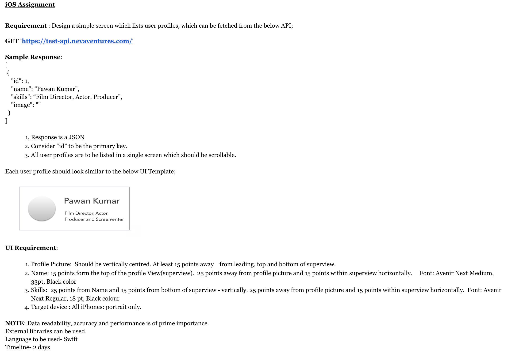

# NevaAssignment
Neva Company - iOS Assignment 14-Feb-2019


-------------------

This is Assignment project given by Neva company, I follow the following steps to finish the assignment.
# Step by Step Solution

### Step1: Create new iOS application.
Created new single page iOS application, named as `ManishAssignment`.

### Step2: Install the external dependency/library
This project need web-service integration, also require download images from server. So I added below two cocoa pods-dependency:
- **Alamofire** for web-service integration.
- **Kingfisher** for image download & image-cache. Now a days one of the best library written in pure Swift.

#### CocoaPods Installation for Above
[CocoaPods](http://cocoapods.org) is a dependency manager for CocoaProjects.
```ruby
source 'https://github.com/CocoaPods/Specs.git'

# ignore all warnings from all pods
inhibit_all_warnings!

platform :ios, '10.0'
target 'ManishAssignment' do
    use_frameworks!

    pod 'Alamofire'
    pod 'Kingfisher'

    target 'ManishAssignmentTests' do
        #Pods for Testing.
    end
end
```

### Step3: Build ApiClientManager.
Build the `ApiClientManager` top of Alamofire framework, This is helpful for unit-testing also if we need to replace `Alamofire` with different library can be easily done.
Currently ApiClientManager can perform:
- `GET` web-service
- `POST` web-service
- `PUT` web-service
- `DELETE` web-service

**Note**: Every request of ApiClientManager take `APIRequest` Type object as input and return `APIResponse` Type object in response.

# ---------------------- Updating ReadMe file (In PROGRESS) -----------------------------

# Requirements
- iOS 10.0+
- Xcode 10.1
- macOS 10.14

# Swift version
* Swift 4.2

# LICENSE
* MIT
